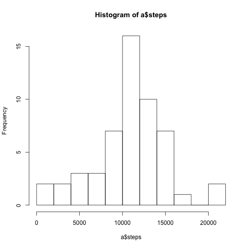
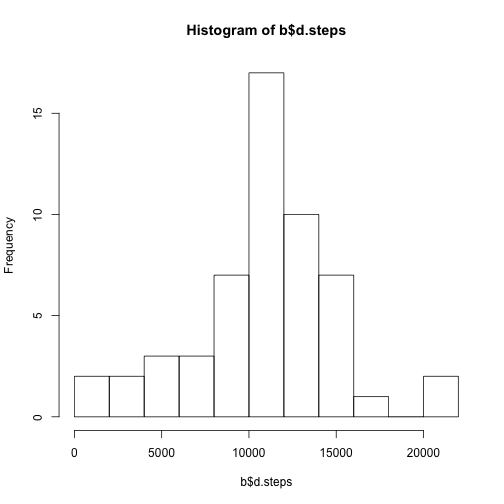
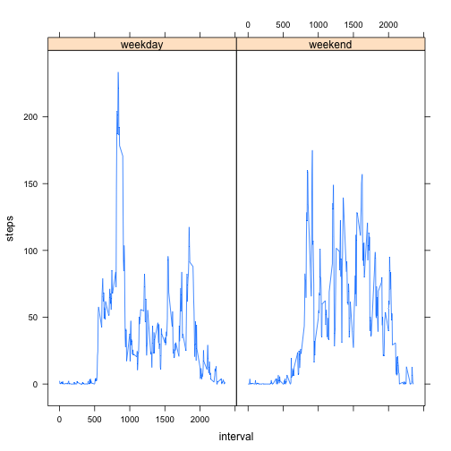

### Author: Matteo Forgiarini, Milan, Italy
Reading the data and checking file structure and lenght

```r
library(lattice)
setwd("~/Desktop/RepData_PeerAssessment1")
d=read.csv(file = "activity.csv")
head(d)
```

```
##   steps       date interval
## 1    NA 2012-10-01        0
## 2    NA 2012-10-01        5
## 3    NA 2012-10-01       10
## 4    NA 2012-10-01       15
## 5    NA 2012-10-01       20
## 6    NA 2012-10-01       25
```

```r
summary(d)
```

```
##      steps                date          interval     
##  Min.   :  0.00   2012-10-01:  288   Min.   :   0.0  
##  1st Qu.:  0.00   2012-10-02:  288   1st Qu.: 588.8  
##  Median :  0.00   2012-10-03:  288   Median :1177.5  
##  Mean   : 37.38   2012-10-04:  288   Mean   :1177.5  
##  3rd Qu.: 12.00   2012-10-05:  288   3rd Qu.:1766.2  
##  Max.   :806.00   2012-10-06:  288   Max.   :2355.0  
##  NA's   :2304     (Other)   :15840
```

```r
nrow(d)
```

```
## [1] 17568
```

Calculating the total number of steps taken per day

```r
attach(d)
a=data.frame(aggregate(steps~date, FUN=sum))
head(a)
```

```
##         date steps
## 1 2012-10-02   126
## 2 2012-10-03 11352
## 3 2012-10-04 12116
## 4 2012-10-05 13294
## 5 2012-10-06 15420
## 6 2012-10-07 11015
```


Making a histogram of the total number of steps taken each day

```r
hist(a$steps, 10)
```

 
Calculating and reporting the mean and median of the total number of steps taken per day

```r
mean(a$steps)
```

```
## [1] 10766.19
```

```r
median(a$steps)
```

```
## [1] 10765
```

Making a time series plot (i.e. type = "l") of the 5-minute interval (x-axis) and the average number of steps taken, averaged across all days (y-axis)

```r
b=data.frame(aggregate(steps~interval, FUN=mean))
head(b)
```

```
##   interval     steps
## 1        0 1.7169811
## 2        5 0.3396226
## 3       10 0.1320755
## 4       15 0.1509434
## 5       20 0.0754717
## 6       25 2.0943396
```

```r
detach(d)
attach(b)
plot(x = interval, y =steps, type = "l" )
```

 

Calculating the  5-minute interval, on average across all the days in the dataset, containing the maximum number of steps

```r
m=max(steps)
b[steps==m,]$interval
```

```
## [1] 835
```

Calculating and reporting the total number of missing values in the dataset (i.e. the total number of rows with NAs)

```r
nrow(d) 
```

```
## [1] 17568
```

```r
ok=complete.cases(d)
d1=d[!ok,]
nrow(d1)
```

```
## [1] 2304
```

```r
head(d1, 10)
```

```
##    steps       date interval
## 1     NA 2012-10-01        0
## 2     NA 2012-10-01        5
## 3     NA 2012-10-01       10
## 4     NA 2012-10-01       15
## 5     NA 2012-10-01       20
## 6     NA 2012-10-01       25
## 7     NA 2012-10-01       30
## 8     NA 2012-10-01       35
## 9     NA 2012-10-01       40
## 10    NA 2012-10-01       45
```
Devising a strategy for filling in all of the missing values in the dataset.

####I'm going to fill the Nas with the mean of their own interval averaged across the dataset.

Creating a new dataset that is equal to the original dataset but with the missing data filled in.

```r
b=data.frame(aggregate(d$steps~d$interval, FUN=mean))
head(b)
```

```
##   d.interval   d.steps
## 1          0 1.7169811
## 2          5 0.3396226
## 3         10 0.1320755
## 4         15 0.1509434
## 5         20 0.0754717
## 6         25 2.0943396
```

```r
for(i in (1:nrow(d))) {
   d[i,1]= ifelse(is.na(d[i,1]), b[i,2], d[i,1])
}
head(d)
```

```
##       steps       date interval
## 1 1.7169811 2012-10-01        0
## 2 0.3396226 2012-10-01        5
## 3 0.1320755 2012-10-01       10
## 4 0.1509434 2012-10-01       15
## 5 0.0754717 2012-10-01       20
## 6 2.0943396 2012-10-01       25
```
Making a histogram of the total number of steps taken each day and Calculating and reporting the mean and median total number of steps taken per day.

```r
head(d)
```

```
##       steps       date interval
## 1 1.7169811 2012-10-01        0
## 2 0.3396226 2012-10-01        5
## 3 0.1320755 2012-10-01       10
## 4 0.1509434 2012-10-01       15
## 5 0.0754717 2012-10-01       20
## 6 2.0943396 2012-10-01       25
```

```r
b=data.frame(aggregate(d$steps~d$date, FUN=sum))
head(b)
```

```
##       d.date  d.steps
## 1 2012-10-01 10766.19
## 2 2012-10-02   126.00
## 3 2012-10-03 11352.00
## 4 2012-10-04 12116.00
## 5 2012-10-05 13294.00
## 6 2012-10-06 15420.00
```

```r
hist(b$d.steps,10)
```

 

```r
mean(b$d.steps)
```

```
## [1] 10766.19
```

```r
median(b$d.steps)
```

```
## [1] 10765.59
```
#### Mean and median total number of steps taken per day do not differ from estimates calculated before imputing Nas with data from specific interval.

Creating a new factor variable in the dataset with two levels  (weekday and weekend) indicating whether a given date is a weekday or weekend day.

```r
head(d)
```

```
##       steps       date interval
## 1 1.7169811 2012-10-01        0
## 2 0.3396226 2012-10-01        5
## 3 0.1320755 2012-10-01       10
## 4 0.1509434 2012-10-01       15
## 5 0.0754717 2012-10-01       20
## 6 2.0943396 2012-10-01       25
```

```r
d$daynumber=as.POSIXlt(d[[2]])$wday
head(d)
```

```
##       steps       date interval daynumber
## 1 1.7169811 2012-10-01        0         1
## 2 0.3396226 2012-10-01        5         1
## 3 0.1320755 2012-10-01       10         1
## 4 0.1509434 2012-10-01       15         1
## 5 0.0754717 2012-10-01       20         1
## 6 2.0943396 2012-10-01       25         1
```

```r
for(i in (1:nrow(d))) {
d[i,"daytype"]= ifelse((d[i,4]>0 & d[i,4]<6), "weekday", "weekend")
}
head(d)
```

```
##       steps       date interval daynumber daytype
## 1 1.7169811 2012-10-01        0         1 weekday
## 2 0.3396226 2012-10-01        5         1 weekday
## 3 0.1320755 2012-10-01       10         1 weekday
## 4 0.1509434 2012-10-01       15         1 weekday
## 5 0.0754717 2012-10-01       20         1 weekday
## 6 2.0943396 2012-10-01       25         1 weekday
```
Making a panel plot containing a time series plot (i.e. type = "l") of the 5-minute interval (x-axis) and the average number of steps taken, averaged across all weekday days or weekend days (y-axis).


```r
head(d)
```

```
##       steps       date interval daynumber daytype
## 1 1.7169811 2012-10-01        0         1 weekday
## 2 0.3396226 2012-10-01        5         1 weekday
## 3 0.1320755 2012-10-01       10         1 weekday
## 4 0.1509434 2012-10-01       15         1 weekday
## 5 0.0754717 2012-10-01       20         1 weekday
## 6 2.0943396 2012-10-01       25         1 weekday
```

```r
wd=data.frame(aggregate(d[d$daytype=="weekday",]$steps~d[d$daytype=="weekday",]$interval, FUN=mean))
names(wd)=c("interval", "steps")
wd$daytype="weekday"
head(wd)
```

```
##   interval     steps daytype
## 1        0 2.3179245 weekday
## 2        5 0.4584906 weekday
## 3       10 0.1783019 weekday
## 4       15 0.2037736 weekday
## 5       20 0.1018868 weekday
## 6       25 1.5273585 weekday
```

```r
we=data.frame(aggregate(d[d$daytype=="weekend",]$steps~d[d$daytype=="weekend",]$interval, FUN=mean))
names(we)=c("interval", "steps")
we$daytype="weekend"
dd=rbind(wd,we)
xyplot  (steps ~ interval | daytype, data = dd,
type = "l", lty = 1)
```

 


